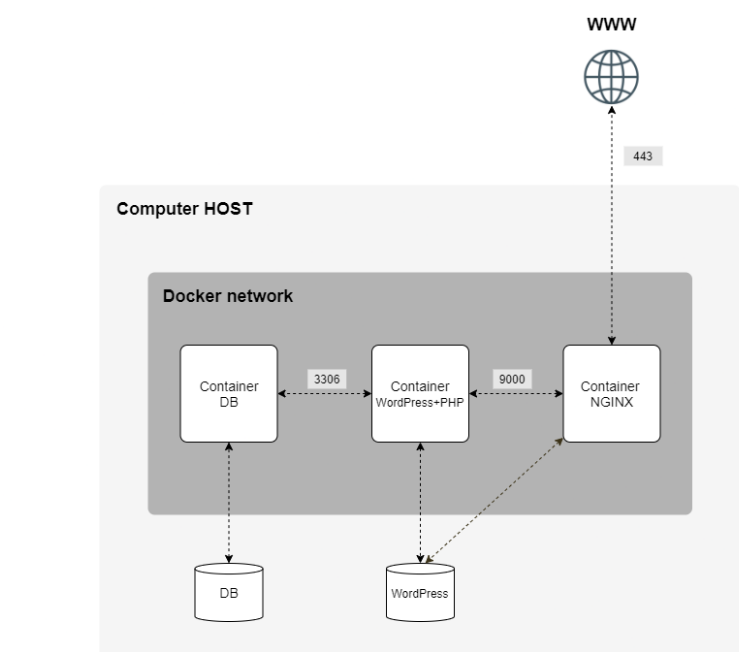

*This project has been created as part of the 42 curriculum by ypacileo.*

# Inception

## Description

Inception is a system administration project from the 42 curriculum. Its goal
is to build and manage a small web infrastructure using Docker Compose inside
a virtual machine.

The infrastructure consists of three services: NGINX, WordPress with PHP-FPM,
and MariaDB. Each service runs in its own container and is built from a
Debian 12 base image using a dedicated Dockerfile. Pre-built application
images are not used.

NGINX is the only public entry point to the infrastructure. It accepts HTTPS
connections on port 443 using TLS 1.2 or TLS 1.3. Requests for PHP resources
are forwarded to the WordPress container through FastCGI on port 9000.
WordPress connects to MariaDB on port 3306 to store and retrieve the website's
persistent data.

Docker Compose defines how the images are built and how the containers,
network, volumes, environment variables and secrets are connected. A Makefile
provides the main commands for building, starting, stopping and cleaning the
infrastructure.

## Architecture

The infrastructure uses a dedicated Docker bridge network named `inception`.
The containers communicate through this private network using their Compose
service names as DNS hostnames.

The request flow is:

1. A client connects to `https://ypacileo.42.fr` through port 443.
2. NGINX terminates the TLS connection.
3. NGINX serves static files directly from the shared WordPress volume.
4. PHP requests are forwarded to `wordpress:9000` using FastCGI.
5. PHP-FPM executes the WordPress application.
6. WordPress connects to `mariadb:3306` using its database credentials.
7. MariaDB reads or modifies the persistent website data.

Only NGINX publishes a port on the host. WordPress and MariaDB remain accessible
only through the internal Docker network.

## Services and sources

| Service | Purpose | Source |
| --- | --- | --- |
| NGINX | Provides the HTTPS entry point, serves static files and forwards PHP requests to PHP-FPM. | Installed from the Debian 12 package repositories. |
| WordPress | Provides the content management system and is executed through PHP-FPM 8.2. | WordPress 7.1 is downloaded from `wordpress.org`; PHP and its extensions are installed from the Debian 12 package repositories. |
| MariaDB | Stores WordPress posts, comments, users, settings and other persistent relational data. | Installed from the Debian 12 package repositories. |
| WP-CLI | Installs and configures WordPress and creates its users during container initialization. | Downloaded from the official WP-CLI builds repository. |

Every service is built from `debian:12`. The project does not use pre-built
NGINX, WordPress or MariaDB application images.

## Project Infrastructure



## Project structure

```text
.
├── .gitignore
├── Makefile
├── README.md
├── USER_DOC.md
├── DEV_DOC.md
├── secrets/
│   ├── db_password.txt
│   ├── db_root_password.txt
│   ├── wp_admin_password.txt
│   └── wp_user_password.txt
└── srcs/
    ├── .env
    ├── docker-compose.yml
    └── requirements/
        ├── mariadb/
        │   ├── Dockerfile
        │   ├── conf/99-inception.cnf
        │   └── tools/entrypoint.sh
        ├── nginx/
        │   ├── Dockerfile
        │   └── conf/inception.conf
        └── wordpress/
            ├── Dockerfile
            ├── conf/www.conf
            └── tools/
                ├── check-db.php
                └── entrypoint.sh
```

The `secrets/` directory contains local credentials and its text files are
excluded from Git. The `srcs/.env` file contains non-sensitive project
configuration, while each directory under `srcs/requirements/` contains the
files needed to build and configure one service.

## Main design choices

### Virtual Machines and Docker

#### Virtual machines

A virtual machine emulates a complete computer. It runs its own operating
system, kernel, system services and applications on virtualized hardware
provided by a hypervisor such as VirtualBox.

#### Docker containers

A Docker container is an isolated process running on the host operating
system. Containers share the host kernel but have their own filesystem,
processes, network interfaces and resource limits.

#### Main differences

| Aspect | Virtual machine | Docker container |
| --- | --- | --- |
| Operating system | Runs a complete guest operating system. | Shares the host kernel and contains only the application and its dependencies. |
| Isolation | Isolated at the virtual hardware level. | Isolated at the process and namespace level. |
| Startup | Usually takes longer because an operating system must boot. | Usually starts quickly because it launches an isolated process. |
| Resources | Requires more memory and storage. | Is generally lighter and uses fewer resources. |
| Portability | Packages an entire machine environment. | Packages an application and its runtime dependencies. |
| Role in this project | Provides the Linux environment required by the subject. | Separates NGINX, WordPress and MariaDB into independent services. |

This project uses both technologies rather than choosing one over the other.
The virtual machine provides an isolated Linux host, while Docker provides a
reproducible and modular environment for each service.

### PID 1 and container lifecycle

In Linux, PID 1 is the first process started in a process namespace. On a
traditional operating system, PID 1 is normally an init system such as
`systemd`, which starts and supervises the remaining system services.

A container does not normally start a complete init system. Its entrypoint or
default command becomes PID 1 inside the container. If that process exits,
Docker considers the container stopped. The main process must therefore remain
in the foreground and receive termination signals correctly.

In this project, NGINX runs with `daemon off;` and PHP-FPM runs with the `-F`
option. The MariaDB and WordPress entrypoint scripts finish with `exec "$@"`,
which replaces the shell with `mariadbd` or PHP-FPM. As a result, the real
service becomes PID 1 instead of being left as a child of the initialization
script.

### Secrets and environment variables

Environment variables are key-value pairs provided to a process at runtime.
They are suitable for non-sensitive configuration such as database names,
domain names, usernames, email addresses and installation options.

Docker Secrets are intended for sensitive information. In this project, each
secret is provided to an authorized container as a read-only file under
`/run/secrets/`. The entrypoint reads the required value from that file during
container initialization.

#### Main differences

| Aspect | Environment variable | Docker Secret |
| --- | --- | --- |
| Intended use | Non-sensitive configuration. | Passwords and other sensitive values. |
| Delivery | Added to the process environment. | Mounted as a file under `/run/secrets/`. |
| Image storage | Not included in the image when supplied at runtime. | Not included in the image. |
| Service access | Available to the container receiving the variable. | Mounted only in services that declare the secret. |
| Examples in this project | Domain name, database name, usernames, emails and WordPress settings. | MariaDB root password, database user password and both WordPress user passwords. |

A process or administrator with sufficient permissions inside an authorized
container can still read its secret files. Docker Secrets do not make values
invisible; their main benefit is separating credentials from image layers and
limiting their distribution to the services that require them.


### Docker Network and host network

A Docker bridge network creates an isolated virtual network for containers.
Containers attached to the same network can communicate through internal ports
and resolve one another through Docker DNS. Host networking instead makes a
container use the host's network namespace directly.

| Aspect | Docker bridge network | Host network |
| --- | --- | --- |
| Isolation | Provides a private network for the containers. | Shares the host network namespace. |
| Service discovery | Compose service names can be used as DNS hostnames. | Services use the host network directly. |
| Port exposure | Only explicitly published ports are accessible from the host. | Container services bind directly to host ports. |
| Port conflicts | Different containers can reuse internal ports. | Services can conflict over the same host port. |
| Use in this project | Used by all three services through the `inception` network. | Not used. |

The dedicated bridge network keeps MariaDB and PHP-FPM private. NGINX reaches
PHP-FPM at `wordpress:9000`, and WordPress reaches the database at
`mariadb:3306`. Only NGINX publishes port 443 on the host.

### Docker volumes and bind mounts

A Docker volume is declared and managed through Docker and has a logical name
independent of a container. A bind mount maps a specific host path directly
into a container. Bind mounts therefore depend more strongly on the host's
directory structure.

| Aspect | Docker volume | Bind mount |
| --- | --- | --- |
| Management | Declared and managed through Docker. | Based directly on a user-selected host path. |
| Host path | Normally chosen by Docker. | Explicitly selected by the user. |
| Portability | Less dependent on a particular host path. | Depends on the host filesystem layout. |
| Typical use | Persistent application data. | Development files or host-managed configuration. |

This project declares two named volumes, `mariadb_data` and `wordpress_data`.
They use the local volume driver with bind options so that their data is stored
in known host directories:

| Volume | Host directory | Container directory | Persistent content |
| --- | --- | --- | --- |
| `mariadb_data` | `/home/ypacileo/data/mariadb` | `/var/lib/mysql` | MariaDB system files and WordPress database data. |
| `wordpress_data` | `/home/ypacileo/data/wordpress` | `/var/www/html` | WordPress core files, configuration, themes, plugins and uploaded media. |

The WordPress volume is mounted read-write by the WordPress container and
read-only by NGINX. The MariaDB volume is mounted only by MariaDB. The Compose
volume names provide lifecycle management, while the bind options satisfy the
requirement that persistent data be stored under `/home/ypacileo/data`.

## Instructions

### Prerequisites

- A Linux virtual machine.
- Docker Engine with the Docker Compose plugin.
- `make` and permission to execute Docker commands with `sudo`.
- A local mapping from `ypacileo.42.fr` to the IP address used to access the
  virtual machine.
- The four required password files under `secrets/`.

If the website is accessed from inside the virtual machine, add this entry to
its `/etc/hosts` file:

```text
127.0.0.1 ypacileo.42.fr
```

Log in at https://ypacileo.42.fr/wp-admin with both the admin user and the second user, and confirm the second one has a restricted menu (no Plugins/Users/Settings).


### Configuration

The non-sensitive configuration is stored in `srcs/.env`. It defines the
domain, MariaDB database and user, WordPress users and site settings, and the
host directory used for persistent data.

The following local files must exist before the first launch:

```text
secrets/db_password.txt
secrets/db_root_password.txt
secrets/wp_admin_password.txt
secrets/wp_user_password.txt
```

Each file must contain only the password required for its corresponding
account. These files are excluded from Git by `.gitignore`.

### Build and start

Run the following command from the repository root:

```sh
make
```

The default target creates `/home/ypacileo/data/mariadb` and
`/home/ypacileo/data/wordpress` when necessary, builds the three images and
starts the infrastructure in detached mode.

The website is then available at:

```text
https://ypacileo.42.fr
```

Because the project uses a self-signed certificate, the browser may display a
certificate warning during local access.

### Makefile commands

| Command | Action |
| --- | --- |
| `make` or `make up` | Create the data directories, build the images and start the infrastructure. |
| `make prepare` | Validate `DATA_PATH` and create the persistent data directories. |
| `make build` | Build all images without starting the containers. |
| `make status` | Display the status of the Compose services. |
| `make logs` | Follow the logs from all services. |
| `make stop` | Stop existing containers without removing them. |
| `make start` | Start existing stopped containers. |
| `make restart` | Restart existing containers. |
| `make down` | Remove containers and the Compose network while preserving images, volumes and data. |
| `make clean` | Perform the same container and network cleanup as `make down`. |
| `make fclean` | Remove containers, project images, named volumes and the persistent MariaDB and WordPress directories. |
| `make re` | Perform a full cleanup and rebuild the project from the beginning. |

Be careful with `make fclean` and `make re`: both delete the persistent website
and database data stored under `/home/ypacileo/data`.

## Use of artificial intelligence

Artificial intelligence was used as a learning and review tool during the
development of this project.

It was used for:

- clarifying Docker, Docker Compose, TLS, PHP-FPM and MariaDB concepts.
- explaining the interaction between the three services.
- reviewing configuration choices and suggesting verification commands.
- identifying possible failure cases in entrypoint scripts.

The generated suggestions were not used without verification. Commands,
configuration files and scripts were tested manually inside the virtual
machine, and the final implementation was reviewed and adapted to comply with
the project requirements.

## Resources

* https://docs.docker.com/get-started/get-docker/
* https://docs.docker.com/get-started/docker-overview/
* https://mariadb.com/docs
* https://mariadb.com/docs/server/mariadb-quickstart-guides/installing-mariadb-server-guide
* https://nginx.org/en/docs/http/configuring_https_servers.html
* https://wordpress.org/cli/
* https://www.youtube.com/watch?v=UZpyvK6UGFo&list=PLqRCtm0kbeHAep1hc7yW-EZQoAJqSTgD-